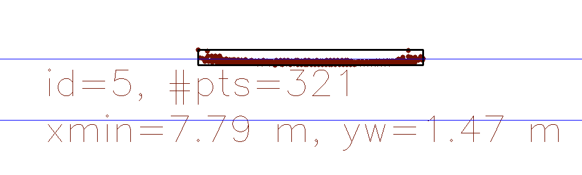
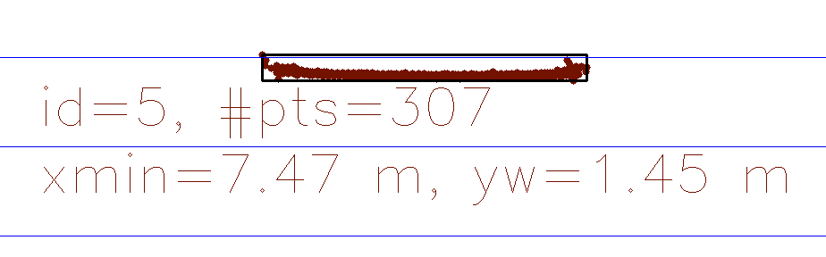
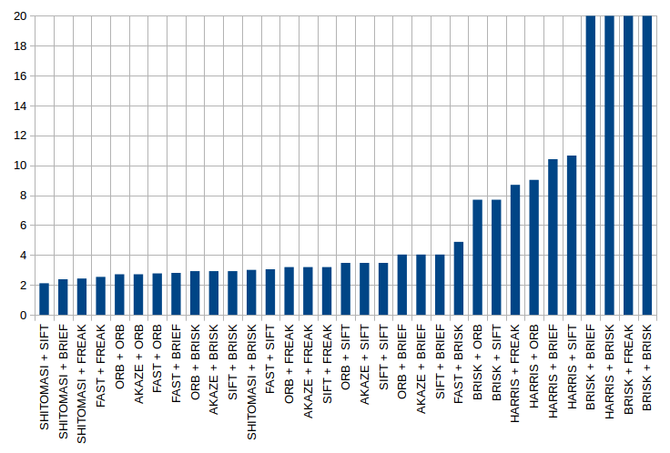

# SFND 3D Object Tracking

Welcome to the final project of the camera course. By completing all the lessons, you now have a solid understanding of keypoint detectors, descriptors, and methods to match them between successive images. Also, you know how to detect objects in an image using the YOLO deep-learning framework. And finally, you know how to associate regions in a camera image with Lidar points in 3D space. Let's take a look at our program schematic to see what we already have accomplished and what's still missing.

In this final project, you will implement the missing parts in the schematic. To do this, you will complete four major tasks: 
1. First, you will develop a way to match 3D objects over time by using keypoint correspondences. 
2. Second, you will compute the TTC based on Lidar measurements. 
3. You will then proceed to do the same using the camera, which requires to first associate keypoint matches to regions of interest and then to compute the TTC based on those matches. 
4. And lastly, you will conduct various tests with the framework. Your goal is to identify the most suitable detector/descriptor combination for TTC estimation and also to search for problems that can lead to faulty measurements by the camera or Lidar sensor. In the last course of this Nanodegree, you will learn about the Kalman filter, which is a great way to combine the two independent TTC measurements into an improved version which is much more reliable than a single sensor alone can be. But before we think about such things, let us focus on your final project in the camera course. 

## Dependencies for Running Locally
* cmake >= 2.8
  * All OSes: [click here for installation instructions](https://cmake.org/install/)
* make >= 4.1 (Linux, Mac), 3.81 (Windows)
  * Linux: make is installed by default on most Linux distros
  * Mac: [install Xcode command line tools to get make](https://developer.apple.com/xcode/features/)
  * Windows: [Click here for installation instructions](http://gnuwin32.sourceforge.net/packages/make.htm)
* Git LFS
  * Weight files are handled using [LFS](https://git-lfs.github.com/)
* OpenCV >= 4.1
  * This must be compiled from source using the `-D OPENCV_ENABLE_NONFREE=ON` cmake flag for testing the SIFT and SURF detectors.
  * The OpenCV 4.1.0 source code can be found [here](https://github.com/opencv/opencv/tree/4.1.0)
* gcc/g++ >= 5.4
  * Linux: gcc / g++ is installed by default on most Linux distros
  * Mac: same deal as make - [install Xcode command line tools](https://developer.apple.com/xcode/features/)
  * Windows: recommend using [MinGW](http://www.mingw.org/)

## Basic Build Instructions

1. Clone this repo.
2. Make a build directory in the top level project directory: `mkdir build && cd build`
3. Compile: `cmake .. && make`
4. Run it: `./3D_object_tracking`.

## Rubic points

### FP.5 Performance Evaluation 1
Find examples where the TTC estimate of the Lidar sensor does not seem plausible. Describe your observations and provide a sound argumentation why you think this happened.

In two situations lidar TTC estimate was obviously incorrect. This was easily visible since
TTC estimate had big changes between two subsequent time frames.

1) TTC estimate jumps from ~11s to ~19s and than back to ~13s.
Point cloud situation:

2) TTC estimate jumps from ~15s to ~20s and than back to ~12s again
Point cloud situation:
   
 
   
Both of these occur since there are some outliers in both time frames. In addition to this,
TTC is estimated as:
`TTC = meanCurr * dT / (meanPrev - meanCurr);`

So small difference between closest previous and closest current point will cause greater TTC estimates.
For detection of closest point median point is used. This significantly suppresses outliers.

### FP.6 Performance Evaluation 2
Run several detector / descriptor combinations and look at the differences in TTC estimation. Find out which methods perform best and also include several examples where camera-based TTC estimation is way off. As with Lidar, describe your observations again and also look into potential reasons.

All combinations of detectors/descriptors have been run same as in previous project.
However, in order to find out which combination worked best for TTC estimation, differnt metric is now used.
Instead of looking at how fast detection is, this time focus was on how close camera TTC was to lidar TTC estimation.

Lidar is active sensor in contrast to camera which is passive sensor and with LIDAR we can have some
sense about depth, which is not the case with camera. Even though Lidar TTC estimations are not perfect,
they are more reliable than camera TTC estimates. In order to estimate which detector/descriptor
performs the best when precise TTC estimation is the main goal, we are looking at average TTC error
between LIDAR TTC estimate and Camera TTC estimate over course of 18 time frames.

Here are average errors for each detector/descriptor combination:

From this graph, it is obvios that top 3 candidates are:

| Det/Desc | Average TTC error (s)|
| -------- | ------------------|
| SHITOMASI + ORB | 2.0562 |
| SHITOMASI + SIFT | 2.10864 |
| SHITOMASI + BRIEF | 2.37497 |

There were also situations where camera TTC estimations were obviously erroneous,
and such scenarios occurred multiple times.

1) BRISK + FREAK
   * Frame IDX 12
   * Camera TTC estimate = inf
   * Previous camera estimate = 8.4s
  
2) BRISK + FREAK
    * Frame IDX 10
    * Camera TTC estimate = -545.044s
    * Previous camera estimate = 13.32s

3) HARRIS + SIFT
    * Frame IDX 12
    * Camera TTC estimate = -inf
    * Previous camera estimate = 11.15s
  
Reason for this is there are matched points on the background that don't belong to the car. Since we 
assume that each matched point is located on the vehicle, this mostly causes erroneous TTC estimates.
Lidar has much more stable (but not perfect) TTC estimates and this is why it is used as reference in
camera TTC precision evaluation.

Complete data can be found in `reports/stats.xlsx` file.
